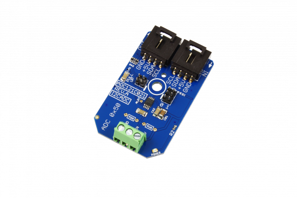

# ADC121C021

[](https://store.ncd.io/product/adc121c021-1-channel-12-bit-analog-to-digital-converter-adc-i2c-mini-module/).

# ADC121C021

The ADC121C021 Analog-to-Digital Converter (ADC), from Texas Instruments, is one of our favorites. We use it in many of our analog I2C mini modules, including our very popular gas sensors.  The ADC121C021 offers 12-bits of resolution across a 0 – 5VDC voltage range.
This Device is available from www.ncd.io

[SKU: ADC121C021_I2CS]

(https://store.ncd.io/product/adc121c021-1-channel-12-bit-analog-to-digital-converter-adc-i2c-mini-module/)
This Sample code can be used with Raspberry Pi.

Hardware needed to interface ADC121C021 12-Bit Analog to Digital Converter With Raspberry Pi : 

1. <a href="https://store.ncd.io/product/adc121c021-1-channel-12-bit-analog-to-digital-converter-adc-i2c-mini-module/">ADC121C021 1-Channel 12-Bit Analog to Digital Converter</a>

2. <a href="https://store.ncd.io/product/i2c-shield-for-raspberry-pi-3-pi2-with-outward-facing-i2c-port-terminates-over-hdmi-port/">Raspberry Pi I2C Shield</a>

3. <a href="https://store.ncd.io/product/i%C2%B2c-cable/">I2C Cable</a>

## Python

Download and install smbus library on Raspberry pi. Steps to install smbus are provided at:

https://pypi.python.org/pypi/smbus-cffi/0.5.1

Download (or git pull) the code in pi. Run the program.

```cpp
$> python ADC121C021.py
```

The lib is a sample library, you will need to calibrate the sensor according to your application requirement.
